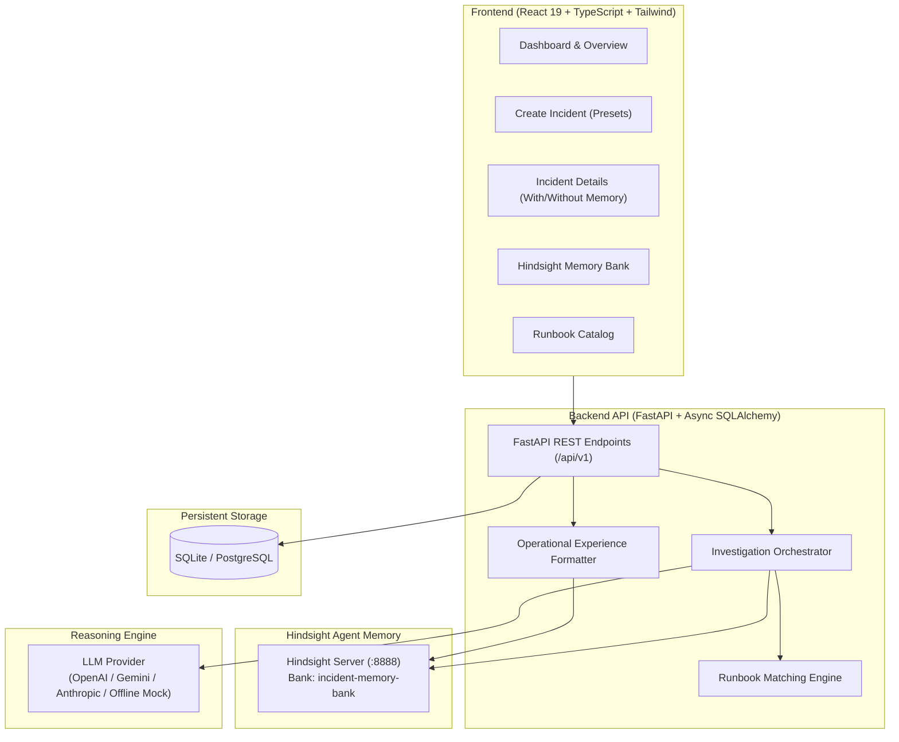

# Incident Memory Agent

> **A memory-driven AI Incident Response Agent for software and DevOps teams powered by [Hindsight](https://github.com/vectorize-io/hindsight) agent memory.**

[](https://fastapi.tiangolo.com)
[](https://react.dev)
[](https://www.typescriptlang.org)
[](https://tailwindcss.com)
[](https://www.sqlalchemy.org)
[](https://github.com/vectorize-io/hindsight)

---

## 📋 Overview

The **Incident Memory Agent** is an autonomous operational assistant built for Site Reliability Engineers (SREs) and DevOps teams. Instead of treating every production incident as a brand-new, isolated event or acting like a generic chatbot, this agent leverages long-term institutional memory to recall past post-mortems, correlate telemetry across time, recommend tested runbooks, and record new operational learnings.

---

## 🎯 The Problem

Production outages cost modern organizations thousands of dollars per minute. While engineering teams dutifully write post-mortems and post-incident documentation, that institutional wisdom becomes trapped in static wikis, stale Notion documents, or buried Slack threads.

When an outage strikes at 2 AM:
- **Engineers start from scratch:** Troubleshooting begins from first principles, repeating debugging mistakes already solved months earlier by teammates.
- **Context is lost:** Key details about subtle config drift, connection leaks, or downstream dependencies evaporate as engineers switch teams.
- **Generic AI fails:** Standard chatbots offer textbook advice (*"have you tried checking your network?"*) without understanding the specific service architecture or previous fixes.

---

## 💡 The Solution

The **Incident Memory Agent** integrates **Hindsight agent memory** directly into the core SRE incident lifecycle:

1. **Intelligent Recall:** On incident creation, the agent queries Hindsight using dense symptoms, error signatures, service names, and environment metadata.
2. **Contextual Investigation:** It compares current observations with historical incidents, identifying proven root causes and relevant standard operating procedures (SOPs).
3. **Dual Investigation Modes:** SREs can explicitly contrast **WITHOUT HINDSIGHT** (stateless baseline) vs. **WITH HINDSIGHT** (memory-augmented) to evaluate the evidentiary boost provided by organizational memory.
4. **Human-in-the-Loop Resolution:** AI proposes hypotheses and matches runbooks, but a human engineer confirms the actual root cause and remediation.
5. **Continuous Retention:** Once resolved, the verified post-mortem is retained in Hindsight, compounding organizational intelligence for future on-call engineers.

---

## 🧠 Core Hindsight Memory Concept

[Hindsight](https://github.com/vectorize-io/hindsight) by Vectorize provides multi-strategy agent memory combining semantic embeddings, graph networks, and temporal reasoning (TEMPR):

- **Bank Namespace (`incident-memory-bank`):** Isolates operational post-mortems into a unified knowledge repository.
- **Structured Experience Formatting:** Incidents are converted into deterministic operational records including incident ID, affected service, environment, severity, symptoms, error signatures, human-confirmed root causes, verified resolutions, and applied runbooks.
- **Dual Recall Mechanics:** Uses dense semantic queries combined with service-level entity filtering. Historical precedents return relevance scores without synthetic inflation.
- **Truthful Offline Degradation:** If the Hindsight cluster is offline or unreachable, the system gracefully degrades to stateless baseline mode, truthfully informing the user without fabricating fake memory entries.

---

## 🏗️ Architecture



---

## 🛠️ Technology Stack

| Layer | Technology | Description |
| :--- | :--- | :--- |
| **Frontend** | React 19, TypeScript, Vite, Tailwind CSS v4 | High-performance responsive SRE dashboard |
| **Icons & UI** | Lucide React | Clean, intuitive operational indicators |
| **Backend API** | FastAPI, Uvicorn, Python 3.10+ | Asynchronous REST backend with strict Pydantic v2 schemas |
| **Database** | SQLAlchemy 2.0 (Async), aiosqlite, asyncpg | SQLite by default for zero-docker local dev; PostgreSQL ready |
| **Memory System** | Official `hindsight-client` Python SDK | Long-term episodic and semantic memory engine |
| **AI / LLM** | Modular Provider (OpenAI, Gemini, Anthropic, Mock) | Structured reasoning with automated offline fallback |
| **Testing** | Vitest (Frontend), Pytest + Asyncio (Backend) | 100% comprehensive unit, integration, and E2E coverage |

---

## 📁 Project Structure

```
incident-memory-agent/
├── backend/
│   ├── app/
│   │   ├── agent/                 # Investigation orchestrator, prompts, LLM providers
│   │   ├── api/v1/                # REST routers (health, incidents, runbooks)
│   │   ├── database/              # Async SQLAlchemy engine, session, and models
│   │   ├── memory/                # Hindsight service and memory formatting
│   │   ├── schemas/               # Pydantic v2 data models and validation
│   │   ├── services/              # Incident CRUD and business logic
│   │   ├── config.py              # Central Pydantic Settings configuration
│   │   ├── logging_config.py      # Structured operational logger
│   │   └── main.py                # FastAPI entrypoint, CORS, lifespan
│   ├── tests/                     # 53 pytest test cases covering all subsystems
│   ├── requirements.txt           # Python backend dependencies
│   └── pytest.ini                # Pytest configuration
├── frontend/
│   ├── src/
│   │   ├── api/                   # Typed API client with custom fetch wrapper
│   │   ├── components/            # Reusable UI components (badges, timeline, comparison modal)
│   │   ├── pages/                 # Dashboard, Create, Details, History, Runbooks, Memory
│   │   ├── types/                 # Shared TypeScript interfaces matching backend schemas
│   │   ├── App.tsx                # React Router and navigation shell
│   │   └── index.css              # Custom Tailwind CSS styling & SRE dark theme
│   ├── package.json               # Node.js dependencies and scripts
│   └── vite.config.ts             # Vite configuration with Vitest setup
├── docs/
│   ├── architecture.md            # Detailed technical design specifications
│   └── demo.md                    # Step-by-step live demo walkthrough
├── scripts/
│   └── smoke_test_e2e.py          # End-to-end ASGI smoke test validating API contracts
├── .env.example                   # Environment configuration template
└── README.md                      # Primary project documentation
```

---

## ⚙️ Environment Variables

Copy `.env.example` to create your local `.env`:

```bash
# Server Configuration
BACKEND_HOST=0.0.0.0
BACKEND_PORT=8000
ENVIRONMENT=development
LOG_LEVEL=INFO
CORS_ORIGINS=http://localhost:5173,http://localhost:3000,http://127.0.0.1:5173

# Database Configuration (SQLite default for zero-docker setup; PostgreSQL supported)
DATABASE_URL=sqlite+aiosqlite:///./incident_memory.db

# Hindsight Agent Memory Service Configuration
HINDSIGHT_BASE_URL=http://localhost:8888
HINDSIGHT_API_KEY=
HINDSIGHT_BANK_ID=incident-memory-bank

# LLM Provider Configuration ('openai', 'gemini', 'anthropic', or 'mock')
LLM_PROVIDER=openai
LLM_MODEL=gpt-4o-mini
OPENAI_API_KEY=
GEMINI_API_KEY=
ANTHROPIC_API_KEY=
```

---

## 🚀 Running Locally

### 1. Prerequisites
- **Python:** 3.10+ (tested on Python 3.14)
- **Node.js:** 18+ (tested on Node.js 24)
- **Docker:** Optional (needed only for running local Hindsight server)

### 2. Backend Setup
```bash
# Navigate to backend directory
cd backend

# Create virtual environment
python -m venv .venv

# Activate virtual environment
# Windows:
.venv\Scripts\activate
# Linux/macOS:
source .venv/bin/activate

# Install dependencies
pip install -r requirements.txt

# Run the FastAPI server
uvicorn app.main:app --host 0.0.0.0 --port 8000 --reload
```
The backend API is now accessible at `http://localhost:8000` with interactive Swagger docs at `http://localhost:8000/docs`.

### 3. Frontend Setup
```bash
# In a new terminal, navigate to frontend
cd frontend

# Install Node dependencies
npm install

# Start Vite development server
npm run dev
```
The SRE dashboard is now live at `http://localhost:5173`.

---

## 🐳 Hindsight Setup (Optional)

If Docker is available on your machine, launch the official Hindsight memory server:

```bash
docker run -d --name hindsight -p 8888:8888 vectorizeio/hindsight
```

Verify Hindsight is running:
```bash
curl http://localhost:8888/version
```

Once running, the Incident Memory Agent automatically connects to `http://localhost:8888` and uses the memory bank `incident-memory-bank`.

> **Note on Offline Fallback:** If Docker is unavailable or Hindsight is not started, the application functions seamlessly in **Stateless Baseline Mode**, gracefully displaying truthful offline status indicators without any crashes.

---

## 🧪 Testing

### Frontend Tests (Vitest)
```bash
cd frontend
npm run test
```
*Executes 16 tests verifying API clients, badge rendering, timeline lifecycle, and memory comparison components.*

### Frontend Production Build
```bash
cd frontend
npm run build
```

### Backend Tests (Pytest)
```bash
# From workspace root
backend\.venv\Scripts\pytest backend\tests -v
```
*Executes 53 tests verifying database transactions, CRUD endpoints, memory formatting, Hindsight RETAIN/RECALL error handling, runbook matching, and dual investigation modes.*

### Live End-to-End Smoke Test
```bash
# From workspace root
backend\.venv\Scripts\python scripts\smoke_test_e2e.py
```
*Performs an end-to-end ASGI test against all endpoints, verifying schema alignment, error handling, human resolution, and retention idempotency.*

---

## 🎮 Demo Workflow: Checkout DB Exhaustion

For complete details, see [`docs/demo.md`](docs/demo.md).

1. **Create Historical Outage:**
   - Go to `/create`, click **"Checkout DB Exhaustion (Primary)"**, and submit.
2. **Run Stateless Baseline:**
   - Under investigation comparison, click **Run Stateless Baseline**. Observe generic diagnosis (~45% confidence, 0 historical precedents).
3. **Confirm & Resolve:**
   - Enter human-confirmed root cause (`PostgreSQL connection pool exhausted by unindexed queries`), select runbook `DB-CONNECTION-01`, and resolve.
4. **Retain in Hindsight:**
   - Click **Retain Experience in Hindsight** to commit the post-mortem to memory.
5. **Simulate Recurring Outage:**
   - Create a second incident with identical checkout symptoms.
6. **Investigate with Hindsight:**
   - Click **Investigate with Hindsight**. The agent retrieves the historical incident, reports corroborated pool exhaustion, cites the past resolution, and recommends runbook `DB-CONNECTION-01` with high confidence (~88%).

---

## ⚠️ Known Limitations & Truthful Disclosures

1. **Hindsight Environment Availability:**
   - In environments without a running Docker engine or network access to a Hindsight instance, the backend gracefully flags Hindsight as offline (`"hindsight_available": false`). The system never fabricates synthetic retention hashes, recall scores, or fake memory IDs.
2. **LLM Provider Keys:**
   - When no external LLM API key (`OPENAI_API_KEY`, etc.) is supplied, the backend automatically uses `MockLLMProvider`. This provider deterministically demonstrates the reasoning contrast between memory-augmented and stateless investigations without making billable external network requests.
3. **Remediation Safety:**
   - The agent strictly acts in an advisory capacity. It generates targeted remediation actions with verification checkpoints, but requires human confirmation before closing an incident. Destructive remediation is never performed autonomously.
